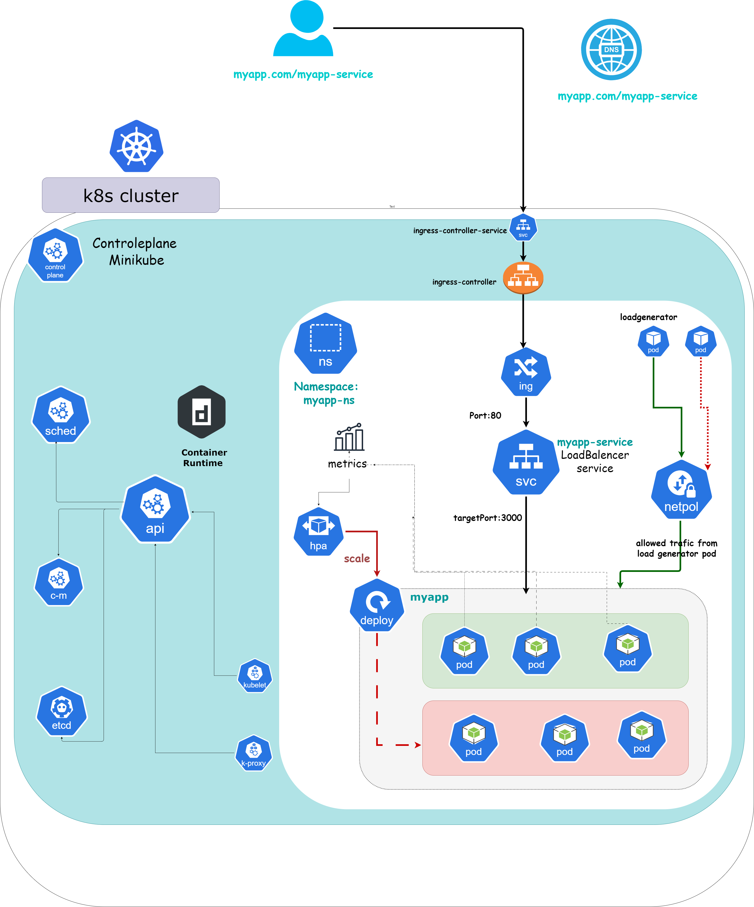

# Project Name

Brief description of your project.

## Table of Contents

- [Introduction](#introduction)
- [Architecture](#architecture)
- [Features](#features)
- [Installation](#installation)
- [Usage](#usage)
- [Contributing](#contributing)
- [License](#license)

## Introduction

Provide an overview of your project, its purpose, and the problem it aims to solve. Explain the importance and relevance of the project within its context.

## Architecture



## Features

List and describe the key features of your project. You can also include any notable functionalities or capabilities.

## Installation


### Prerequisites

A system running  Ubuntu 20.04
2 CPUs or more
2GB of free memory
20GB of free disk space

### Installation Steps

Step 1: Update System and Install Required Packages:

```bash
sudo apt-get update -y
sudo apt-get upgrade -y
```
 install (or check whether you already have) the following required packages:
 
```bash
sudo apt-get install curl
sudo apt-get install apt-transport-https
```
Step 2:install docker :
   Set up Docker's apt repository:
```bash
# Add Docker's official GPG key:
sudo apt-get update
sudo apt-get install ca-certificates curl
sudo install -m 0755 -d /etc/apt/keyrings
sudo curl -fsSL https://download.docker.com/linux/ubuntu/gpg -o /etc/apt/keyrings/docker.asc
sudo chmod a+r /etc/apt/keyrings/docker.asc

# Add the repository to Apt sources:
echo \
  "deb [arch=$(dpkg --print-architecture) signed-by=/etc/apt/keyrings/docker.asc] https://download.docker.com/linux/ubuntu \
  $(. /etc/os-release && echo "$VERSION_CODENAME") stable" | \
  sudo tee /etc/apt/sources.list.d/docker.list > /dev/null
sudo apt-get update
```
Install the Docker packages:
```bash
sudo apt-get install docker-ce docker-ce-cli containerd.io docker-buildx-plugin docker-compose-plugin
```
Step 3: Install Minikube:
download the latest Minikube binary:
```bash
wget https://storage.googleapis.com/minikube/releases/latest/minikube-linux-amd64
```
Copy the downloaded file and store it into the /usr/local/bin/minikube directory :
```bash
sudo cp minikube-linux-amd64 /usr/local/bin/minikube
```
give the file executive permission:
```bash
sudo chmod 755 /usr/local/bin/minikube
```
verify version of Minikube:
```bash
minikube version
```
Step 4: Install Kubectl:
Download kubectl:
```bash
curl -LO https://storage.googleapis.com/kubernetes-release/release/`curl -s https://storage.googleapis.com/kubernetes-release/release/stable.txt`/bin/linux/amd64/kubectl
```
Make the binary executable:
```bash
chmod +x ./kubectl
```
move the binary into path and Verify the installation :
```bash
sudo mv ./kubectl /usr/local/bin/kubectl
kubectl version -o json
```
Step 5: Start Minikube:
```bash
sudo minikube start --force --driver=docker
```


## Usage

Provide instructions on how to use your project. Include examples or code snippets to demonstrate its usage.

## Contributing

Explain how others can contribute to your project. Include guidelines for submitting bug reports, feature requests, or code contributions. 

## License

Specify the license under which your project is distributed. Include any terms or conditions associated with the license.


