# Project Name

Brief description of your project.

## Table of Contents

- [Introduction](#introduction)
- [Architecture](#architecture)
- [Features](#features)
- [Installation](#installation)
- [Usage](#usage)
- [Contributing](#contributing)
- [License](#license)

---

## Introduction

This project involves deploying and managing a scalable web application on Kubernetes, leveraging various Kubernetes resources and configurations to ensure reliability, scalability, and security.

---

## Architecture

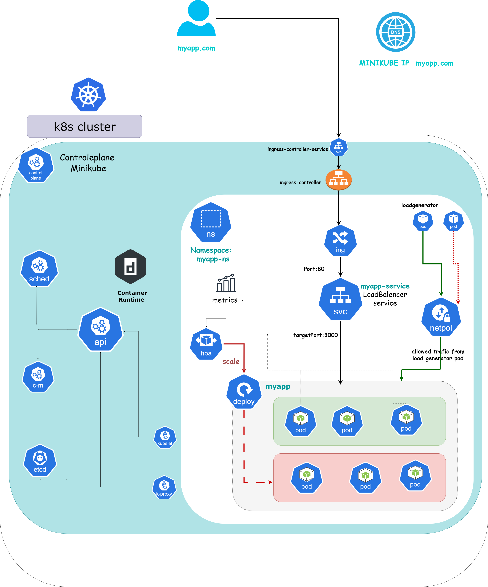

---

## Features

- **Deployment:**
  - The application is deployed using Kubernetes Deployments, allowing for easy management and scaling of application replicas.

- **Service:**
  - A Kubernetes Service is used to expose the application externally.

- **Network Policy:**
  - A Network Policy is implemented to control the flow of traffic to and from the application pods, enhancing security within the cluster.

- **Ingress:**
  - An Ingress resource is configured to manage external access to the application, enabling HTTP routing and load balancing for incoming traffic.

- **Ingress Controller:**
  - An Ingress Controller is deployed to handle Ingress resources, providing advanced routing and traffic management capabilities.

- **Horizontal Pod Autoscaler (HPA):**
  - The application is configured with an HPA to automatically scale the number of pods based on CPU utilization, ensuring optimal performance and resource utilization.

- **Autoscaling:**
  - The application's scalability is further tested using load generation techniques, verifying the effectiveness of the HPA in dynamically adjusting pod counts in response to changing workloads.

---

## Installation


### Prerequisites

*A system running  Ubuntu 20.04*

*2 CPUs or more*

*2GB of free memory*

*20GB of free disk space*

### Installation Minikube Cluster

1. **Update System and Install Required Packages:**

```bash
sudo apt-get update -y
sudo apt-get upgrade -y
```
 install (or check whether you already have) the following required packages:
 
```bash
sudo apt-get install curl
sudo apt-get install apt-transport-https
```
2. **Install Docker:**
   Set up Docker's apt repository:
```bash
# Add Docker's official GPG key:
sudo apt-get update
sudo apt-get install ca-certificates curl
sudo install -m 0755 -d /etc/apt/keyrings
sudo curl -fsSL https://download.docker.com/linux/ubuntu/gpg -o /etc/apt/keyrings/docker.asc
sudo chmod a+r /etc/apt/keyrings/docker.asc

# Add the repository to Apt sources:
echo \
  "deb [arch=$(dpkg --print-architecture) signed-by=/etc/apt/keyrings/docker.asc] https://download.docker.com/linux/ubuntu \
  $(. /etc/os-release && echo "$VERSION_CODENAME") stable" | \
  sudo tee /etc/apt/sources.list.d/docker.list > /dev/null
sudo apt-get update
```
Install the Docker packages:
```bash
sudo apt-get install docker-ce docker-ce-cli containerd.io docker-buildx-plugin docker-compose-plugin
```
3. **Install Minikube:**
download the latest Minikube binary:
```bash
wget https://storage.googleapis.com/minikube/releases/latest/minikube-linux-amd64
```
Copy the downloaded file and store it into the /usr/local/bin/minikube directory :
```bash
sudo cp minikube-linux-amd64 /usr/local/bin/minikube
```
give the file executive permission:
```bash
sudo chmod 755 /usr/local/bin/minikube
```
verify version of Minikube:
```bash
minikube version
```
4. **Install Kubectl:**
Download kubectl:
```bash
curl -LO https://storage.googleapis.com/kubernetes-release/release/`curl -s https://storage.googleapis.com/kubernetes-release/release/stable.txt`/bin/linux/amd64/kubectl
```
Make the binary executable:
```bash
chmod +x ./kubectl
```
move the binary into path and Verify the installation :
```bash
sudo mv ./kubectl /usr/local/bin/kubectl
kubectl version -o json
```
5.**Start Minikube:**
```bash
sudo minikube start --force --driver=docker
```
<p align="center">
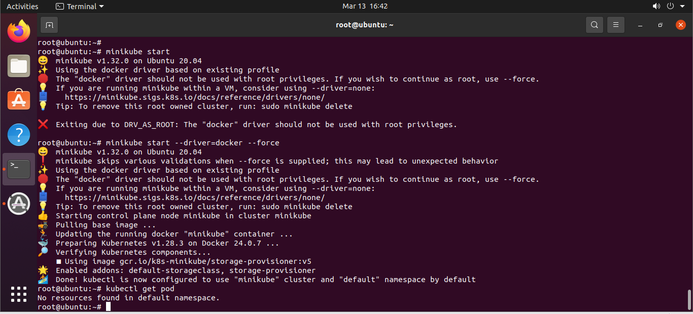
</p>

enable  addons :
```bash
sudo minikube addons enable ingress
sudo minikube addons enable registry
sudo minikube addons enable metrics-server
```
<p align="center">
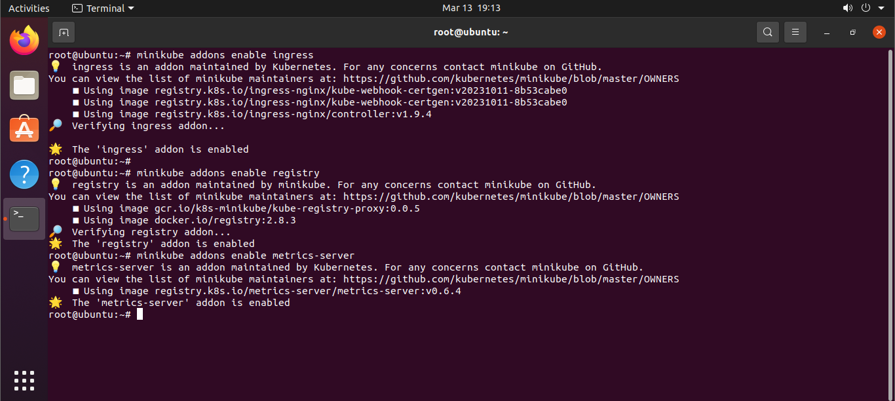
</p>

### Installation Jenkins

1. **Install Java:**
```bash
sudo apt update
sudo apt install openjdk-11-jdk
```
2. **Install Jenkins:**

```bash
curl -fsSL https://pkg.jenkins.io/debian-stable/jenkins.io-2023.key | sudo tee /usr/share/keyrings/jenkins-keyring.asc > /dev/null
echo deb [signed-by=/usr/share/keyrings/jenkins-keyring.asc]  https://pkg.jenkins.io/debian-stable binary/ | sudo tee /etc/apt/sources.list.d/jenkins.list > /dev/null
sudo apt update
sudo apt install jenkins
```
The Jenkins service will launch automatically following installation:
<p align="center">
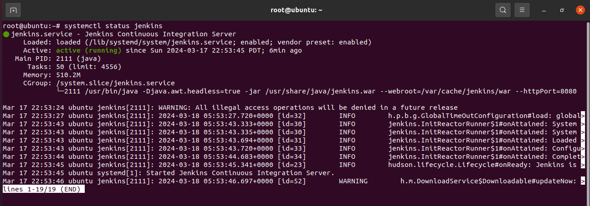
</p>

---

##Usage

### Containerizing my application :

Containerizing a Node.js application involves packaging the application along with its dependencies, libraries, and runtime environment into a container.

1. **Create a Dockerfile in the root directory.**
   
```bash
# Use an existing node image as base image
FROM node:14-alpine

# Set the working directory in the container
WORKDIR /app

# Copy package.json and package-lock.json to the container
COPY package*.json ./

# Install required packages
RUN npm install

# Copy all files to the container
COPY . .

# Expose port 3000
EXPOSE 3000

# Start the application
CMD [ "npm", "start" ]
```
2. **Build the Docker image:**

```bash
docker build -t moha1992/myapp:v1 .
```

<p align="center">
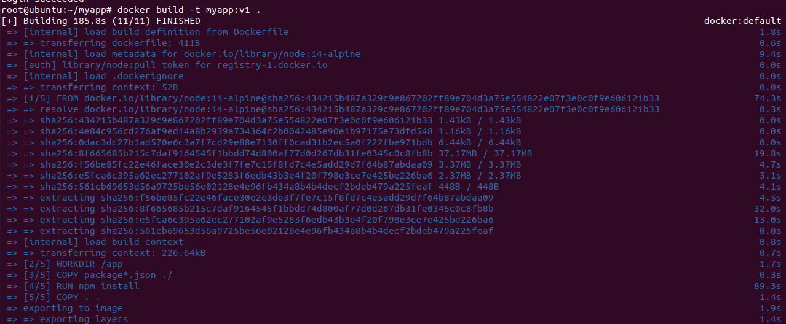
</p>

3. **Log in to Docker Hub and push the Docker image:**

```bash
docker login 
docker push moha1992/myapp:v1
```

<p align="center">
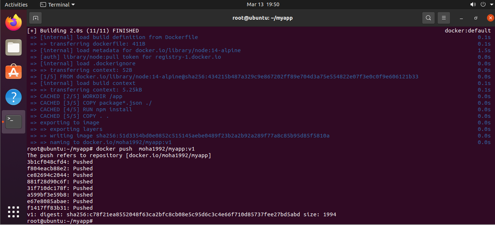
</p>

### Create namespace and Create secret Docker-registry:
- Create namespace: myapp-ns 
 I've just created a new namespace (myapp-ns) in our Kubernetes cluster to manage our applications separately. This namespace helps us maintain isolation and organization within the cluster, making it easier to manage resources and apply security policies.

<p align="center">
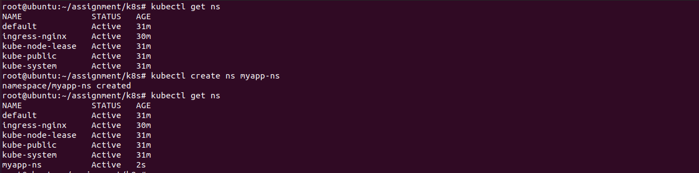
</p>
 
- Create secret Docker-registry for authentication.

the Docker registry secret allow us to securely authenticate with our private Docker registry from within Kubernetes. Essentially, it's a way to securely store our registry credentials, such as usernames and passwords, so we can pull container images during deployment without exposing sensitive information.

<p align="center">
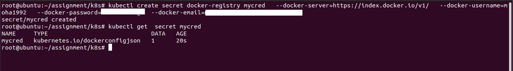
</p>


### Kubernetes deployment :

- Deploy the application using Kubernetes [Deployment.yaml](https://github.com/mmhamdi/assignment/blob/main/k8s/deployment.yaml) :

I've created a Kubernetes Deployment resource named notes-app-deployment within the namespace myapp-ns. This deployment is responsible for managing instances of my containerized application, ensuring that the specified number of replicas (in this case, 2) are running and healthy.

- Configure resources, liveness probe, and readiness probe:

**Resources and Limits:**

Resources (CPU and Memory): I've defined resource requests and limits for CPU and memory in the container specification. This helps Kubernetes scheduler to allocate appropriate resources and ensures that the container doesn't consume excessive resources.


```bash
 resources:
          requests:
            cpu: "50m"  #Specifies the minimum amount of CPU resources required by each container
            memory: "64Mi" #Specifies the minimum amount of memory required by each container
          limits:
            cpu: "100m"  # Specifies the maximum amount of CPU resources the container can use
            memory: "128Mi" # Specifies the maximum amount of memory the container can use
```

**Liveness Probe:**

Liveness Probe: I've configured a liveness probe to determine whether the container is alive and healthy. If the liveness probe fails (i.e., the command within the container fails), Kubernetes restarts the container to try to recover it.

```bash
        livenessProbe:
          exec:        #Executes a specified command (ps aux | grep node) within the container
            command:
            - /bin/sh
            - -c
            - ps aux | grep node
          initialDelaySeconds: 30 # Wait for 30 seconds after the container starts before performing the first probe
          periodSeconds: 10 #Perform the probe every 10 seconds
```

**Readiness Probe:**

Readiness Probe: I've configured a readiness probe to determine whether the container is ready to serve traffic. If the readiness probe fails, the container is removed from the service's load balancing pool to prevent receiving traffic.

```bash
        readinessProbe:
          tcpSocket:       #Checks if the specified port (3000) is accepting connections
            port: 3000
          initialDelaySeconds: 5  #Wait for 5 seconds after the container starts before performing the first probe
          periodSeconds: 10   #Perform the probe every 10 seconds
```


the Deployment resource I've defined ensures that my containerized application is deployed with optimized resource utilization, and it's equipped with liveness and readiness probes for health monitoring and self-healing capabilities within a Kubernetes environment. These features collectively contribute to the reliability, availability, and efficiency of my application deployment

### Service and Ingress :
- Set up a Kubernetes Service to expose the application:
- 
**Service :**

```bash
apiVersion: v1
kind: Service
metadata:
 namespace: myapp-ns
 name: myapp-service
spec:
 selector:
   app: notes-app
 ports:
 - port: 80
   targetPort: 3000
   protocol: TCP
 type: LoadBalancer
```

 I've set up a Kubernetes Service, myapp-service, in the myapp-ns namespace. It acts as a gateway for my app, directing external traffic from port 80 to my app's pods on port 3000. With the LoadBalancer type, Kubernetes automatically provisions an external load balancer, evenly distributing traffic across my app's pods. Users access my app seamlessly without needing to know the Kubernetes setup details

**Ingress:**
- Configure an Ingress resource to manage external access to the application.

Modify the hostname in /etc/hosts:

```bash
IPAADRESSMINIKUBE myapp.com
```
<p align="center">
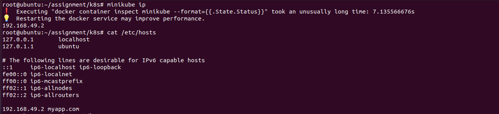
</p>

_Ingress controller:_

Enabling the Ingress addon in Minikube sets up an Ingress controller within our local Kubernetes cluster. This controller acts as a traffic manager, simplifying how we manage external access to our applications by routing traffic based on defined rules. It's like having a router for our Kubernetes cluster, making our deployment and management tasks much easier

<p align="center">
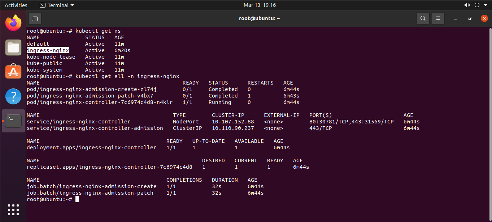
</p>


_Ingress resource:_

```bash
apiVersion: networking.k8s.io/v1
kind: Ingress
metadata:
  name: notes-app-ingress
  namespace: myapp-ns 
spec:
  rules:
    - host: myapp.com
      http:
        paths:
          - path: /
            pathType: Prefix
            backend:
              service:
                name: myapp-service
                port:
                  number: 80
```

I've set up an Ingress resource named notes-app-ingress to manage external access to my app using the myapp.com hostname. It directs incoming requests to the root path (/) of myapp.com to my myapp-service, which handles the app's functionality. It's like a VIP entrance for my app, making external access smooth and hassle-free

_Test Ingress_:

 from terminal :
 
```bash
curl http://myapp.com
```

<p align="center">

</p>

from web browser :

<p align="center">
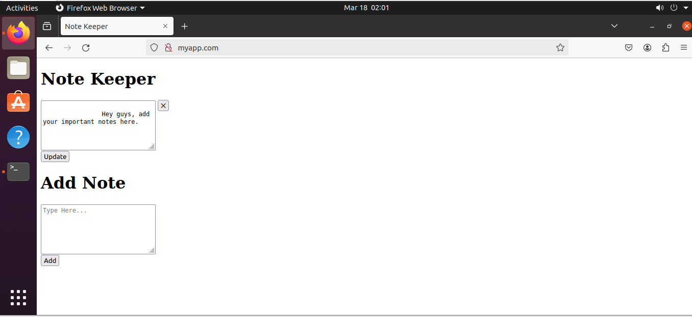
</p>

### Scaling and self-healing  :
_HPA:_
- Configure Horizontal Pod Autoscaler (HPA) for automatic scaling:

```bash
apiVersion: autoscaling/v1  #troubleshooting Since k8s 1.23 autoscaling/v2beta2 is deprecated so i run kubectl api-server
kind: HorizontalPodAutoscaler
metadata:
  name: notes-app-hpa
  namespace: myapp-ns
spec:
  scaleTargetRef:
    apiVersion: apps/v1
    kind: Deployment
    name: notes-app-deployment
  minReplicas: 2
  maxReplicas: 5
  targetCPUUtilizationPercentage: 20 
```

This Horizontal Pod Autoscaler (HPA) automatically adjusts the number of pods in our notes-app-deployment based on CPU consumption. If CPU usage exceeds 20%, it scales up to a maximum of 5 pods. If usage drops below 20%, it scales down to a minimum of 2 pods. This ensures our application can handle varying levels of traffic efficiently

*Senario:*
- Observe automatic scaling based on CPU utilization:

So, here's the setup: I've deployed a load generator pod (load-generator-deployment) in the myapp-ns namespace. This pod continuously generates HTTP requests to our application pods (notes-app-deployment), creating a load on them.

When I applied the load generator, I observed that the application scaled up automatically to accommodate the increased demand. Initially, we had 2 pods running, but as the load increased, Kubernetes dynamically scaled up the number of pods to 5 to handle the additional traffic.

<p align="center">
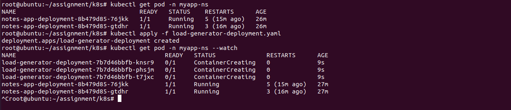
</p>

Now, when I deleted the load generator pod (load-generator-deployment), the load on our application decreased. As a result, Kubernetes automatically scaled down the number of application pods from 5 back to the minimum of 2.


<p align="center">
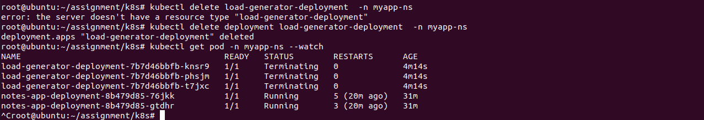
</p>


### Networkpolicy :
- Implement a Network Policy to control pod-to-pod communication.

```bash
apiVersion: networking.k8s.io/v1
kind: NetworkPolicy
metadata:
  name: notes-app-network-policy
  namespace: myapp-ns
spec:
  podSelector:
    matchLabels:
      app: notes-app
  policyTypes:
  - Ingress
  - Egress
  ingress:
  - from:
    - podSelector:
        matchLabels:
          app: load-generator
  egress:
  - to:
    - podSelector:
        matchLabels:
          app: load-generator
```

I've set up this NetworkPolicy called notes-app-network-policy in our Kubernetes cluster. Basically, what it does is control how pods within our application namespace communicate with each other.

Now, the cool part is that it allows communication between our notes-app pods and our load-generator pods. This means our main application pods can talk to the load generator pods, and vice versa. That's important because the load generator helps us stress-test our application.

But here's the kicker: it restricts all other communication. So, any other pods or workloads we have running in the same namespace won't be able to communicate with our notes-app pods or the load generator. This adds a layer of security and ensures that only the necessary communication is allowed, which is super important for protecting our application and data


_Senario:_
- Test the Network Policy to ensure proper configuration.

So, here's the setup: I've created a new deployment called test-network-policy in our Kubernetes cluster. This deployment mimics the behavior of the load generator, generating HTTP requests to stress-test our application just like the load generator did. However, it has a different name and selector.

Now, the goal here is to test our network policy (notes-app-network-policy) to ensure it's configured correctly. We want to verify that only pods labeled app: load-generator or app: test-network-policy can communicate with our notes-app pods, while all other traffic is blocked.

We'll capture the logs from the pods of the test-network-policy deployment to see the HTTP requests being sent to our notes-app pods. These logs should confirm that the test-network-policy pods are blocked : and notes-app is unreacheable

<p align="center">

</p>


1. **Download Helm:**

```bash
$ curl -fsSL -o get_helm.sh https://raw.githubusercontent.com/helm/helm/main/scripts/get-helm-3
$ chmod 700 get_helm.sh
$ ./get_helm.sh
```

2. **Prepare Helm charts.**

[Helm charts](https://github.com/mmhamdi/assignment/tree/main/helm/myapp)

3. **Deploy the application using Helm charts.**

```bash
$ curl -fsSL -o get_helm.sh https://raw.githubusercontent.com/helm/helm/main/scripts/get-helm-3
$ chmod 700 get_helm.sh
$ ./get_helm.sh
```

<p align="center">
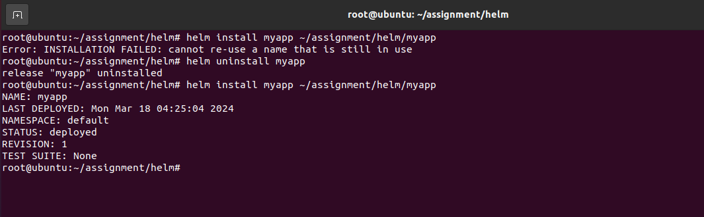
</p>

---
## Configuration de Jenkins pour le déploiement sur Minikube

1. **Installation du Plugin Kubernetes :**
   - Accédez au tableau de bord de Jenkins et cliquez sur "Gérer Jenkins".
   - Naviguez vers "Gérer les Plugins".
   - Recherchez "Plugin Kubernetes" et installez-le.

<p align="center">

  </p>     

2. **Configuration du Plugin Kubernetes :**
   - Allez dans "Gérer Jenkins" > "Configurer le Système".
   - Dans la section "Cloud", cliquez sur "Ajouter un nouveau cloud" > "Kubernetes".
   - Fournissez le chemin vers votre fichier kubeconfig (`~/.kube/config`) et configurez les informations d'identification avec un fichier secret.
   - Testez la connectivité avec Minikube depuis Jenkins.

   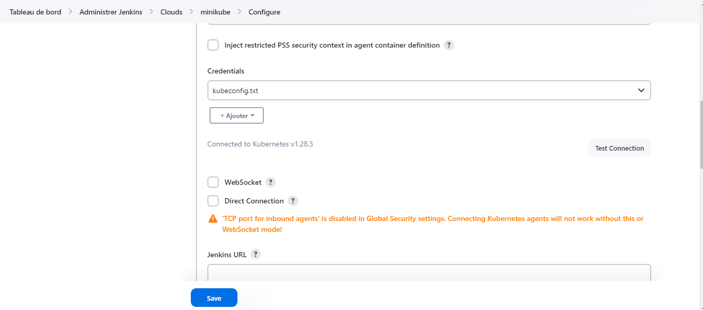

3. **Création d'une Tâche Jenkins :**
   - Créez une nouvelle tâche Jenkins.
   - Utilisez le fichier [JenkinsFile](https://github.com/mmhamdi/assignment/jenkinsfile) fourni pour le déploiement sur Minikube.

4. **Automatisation du Déploiement avec Helm Charts :**
   - Assurez-vous que Helm est installé sur la machine Jenkins.
   - Configurez Jenkins pour utiliser Helm dans votre script de pipeline.
   - Mettez à jour votre Jenkinsfile pour inclure le déploiement avec les charts Helm.
  
<p align="center">

</p>

---

## Troubleshooting

### Issue 1: Kubeadm Initialization Problem
- **Problem**: While initializing kubeadm, encountered an issue.
- **Resolution**: After running `journalctl -u kubelet`, it was evident that swapping needed to be disabled. Executed `swapoff -a` to disable swapping on specified devices or files, resolving the problem.

### Issue 2: Coredns Pods Pending State
- **Problem**: After initiating the cluster and installing networking addons, the Coredns pods remained in a pending state.
- **Resolution**: Removed the existing deployment of Coredns and recreated it, solving the pending state issue.

### Issue 3: Communication Problem between Backend and Database
- **Problem**: Backend deployment unable to recognize the MySQL service, leading to communication problems.
- **Resolution**: Addressed DNS-related issues, allowing the backend pod to reach the MySQL service. Additionally, adjusted resource allocations to prevent pod restarts.

### Issue 4: Minikube Cluster Startup Failure
- **Problem**: Minikube cluster failed to start after restarting the container.
- **Resolution**: Resolved by adjusting the kernel parameter using `sudo sysctl fs.protected_regular=0`, resolving compatibility issues and permissions errors encountered during cluster startup.

### Issue 5: Ingress Controller Pod Pending State
- **Problem**: Ingress controller pod remained in a pending state.
- **Resolution**: Manually refreshed the pod, allowing it to start. Investigated logs to identify underlying issues.

### Additional Considerations:
- Ensure the correct `apiVersion` for Horizontal Pod Autoscaler (HPA) in the cluster.
- When configuring Jenkins credentials for Minikube cluster connection, ensure certificates are encoded properly.


